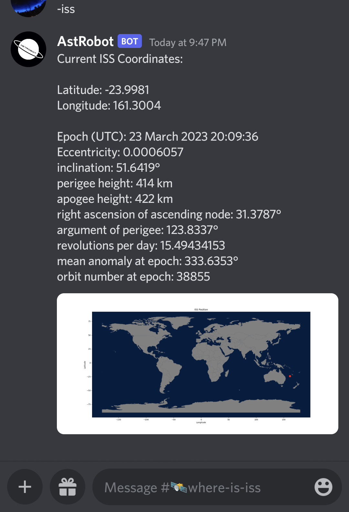

# ISS Orbital Parameters Scraper

This script was made to be integrated into the UCF Astronomy Society's Discord AstroBot so that data could be retrieved by the -iss command. Originally made so that I could get current orbital parameters (plus or minus 2 weeks) to use with my telescope to track the space station on good nights.

## How it works

The script uses [BeautifulSoup](https://pypi.org/project/beautifulsoup4/#:~:text=Beautiful%20Soup%20is%20a%20library,and%20modifying%20the%20parse%20tree.) to get information from the [Heavens Above](https://www.heavens-above.com) iss location page.

A separate program is used to get the current latitude and longitude which displays with the -iss command as well

